# Proyecto Integrador - Gestión de Tareas

## Descripción

Esta es una aplicación web SPA (Single Page Application) para la gestión de tareas diarias, desarrollada para una startup llamada MateCode. Permite a los empleados de una empresa organizar sus tareas de manera persistente y accesible desde cualquier dispositivo. La aplicación incluye autenticación de usuarios, operaciones CRUD completas sobre tareas, persistencia en la nube con Firebase Firestore, y envío de notificaciones por email mediante AWS SES.

### Características Principales
- **Autenticación**: Registro y login con email/password o Google.
- **Gestión de Tareas**: Crear, listar, editar, eliminar y marcar como completadas tareas por usuario.
- **Persistencia**: Datos almacenados en Cloud Firestore, sincronizados en tiempo real.
- **Notificaciones**: Envío de emails con resumen de tareas usando AWS SES.
- **Interfaz Responsive**: Diseño mobile-first con navegación SPA.
- **Testing**: Cobertura con tests unitarios e integración usando Vitest y React Testing Library.
- **Deploy**: Desplegado en Vercel con URL pública.

### Tecnologías Utilizadas
- **Frontend**: React + TypeScript
- **Backend as a Service**: Firebase (Auth + Firestore)
- **Email Service**: AWS SES (invocado vía Vercel Functions)
- **Deploy**: Vercel
- **Testing**: Vitest + React Testing Library
- **Control de Versiones**: Git con commits semánticos

> Nota: Envío de Email (AWS SES)
>
> Debido a que mi cuenta de AWS se encuentra temporalmente suspendida, la integración con AWS SES se ha configurado en modo simulación (mock).
>
> El archivo `api/send-email.js` incluye la lógica real del SDK de AWS comentada y preparada para activarse cuando la cuenta esté habilitada.
>
> Esto permite validar el flujo completo de backend y frontend sin enviar correos reales.

## Arquitectura y Decisiones Técnicas

El proyecto sigue una estructura modular organizada por capas, como se detalla en la estructura sugerida:

- **src/pages/**: Vistas principales (Login, Register, Dashboard)
- **src/components/**: Componentes UI reutilizables (Button, Card, etc.)
- **src/features/**: Lógica por dominio (auth, tasks)
- **src/services/**: Integraciones con Firebase y APIs
- **src/routes/**: Configuración de rutas con protección
- **src/hooks/**: Hooks personalizados para estado y efectos
- **src/types/**: Definiciones TypeScript compartidas
- **src/utils/**: Utilidades como validaciones y formateo
- **api/**: Vercel Functions para envío de emails
- **tests/**: Tests unitarios e integración

### Decisiones Arquitectónicas
- **SPA con React Router**: Navegación sin recargas, con rutas protegidas para usuarios autenticados.
- **TypeScript**: Tipado fuerte para reducir errores y mejorar mantenibilidad.
- **Firebase BaaS**: Solución rápida y escalable para auth y base de datos, evitando backend propio.
- **Vercel Functions**: Serverless para envío de emails, manteniendo secretos seguros.
- **Validaciones**: Lado cliente con funciones reutilizables, integradas en formularios.
- **Testing**: Unit tests para utilidades, integración para componentes críticos.
- **Responsive Design**: CSS-in-JS para estilos modulares y adaptables.

## Instalación y Configuración

### Prerrequisitos
- Node.js (versión 18 o superior)
- npm o yarn
- Cuenta en Firebase (para Auth y Firestore)
- Cuenta en AWS (para SES)
- Cuenta en Vercel (para deploy)

### Pasos de Instalación
1. Clona el repositorio:
   ```bash
   git clone https://github.com/FacundoRozalez/ProyectoM4_FacundoRozalez.git
   cd tu-repo
   ```

2. Instala las dependencias:
   ```bash
   npm install
   ```

3. Configura las variables de entorno (ver sección siguiente).

4. Ejecuta la aplicación en desarrollo:
   ```bash
   npm run dev
   ```

5. Para ejecutar los tests:
   ```bash
   npm run test
   ```

## Variables de Entorno

Crea un archivo `.env` en la raíz del proyecto con las siguientes variables (usa `.env.example` como plantilla):

```env
# Firebase
VITE_FIREBASE_API_KEY=tu_api_key
VITE_FIREBASE_AUTH_DOMAIN=tu_auth_domain
VITE_FIREBASE_PROJECT_ID=tu_project_id
VITE_FIREBASE_STORAGE_BUCKET=tu_storage_bucket
VITE_FIREBASE_MESSAGING_SENDER_ID=tu_sender_id
VITE_FIREBASE_APP_ID=tu_app_id

# AWS SES (para Vercel Functions)
AWS_ACCESS_KEY_ID=tu_access_key
AWS_SECRET_ACCESS_KEY=tu_secret_key
AWS_REGION=tu_region
SES_FROM_EMAIL=tu_email_from

# Vercel (para deploy)
VERCEL_URL=tu_url_produccion
```

**Nota**: Nunca subas el archivo `.env` al repositorio. Usa `.env.example` para compartir la plantilla sin secretos.

## Uso

1. **Registro/Login**: Crea una cuenta o inicia sesión con email/password o Google.
2. **Dashboard**: Una vez autenticado, accede al dashboard para gestionar tareas.
3. **CRUD Tareas**: Crea nuevas tareas con título, descripción, prioridad y fecha de vencimiento. Edita, elimina o marca como completadas.
4. **Filtros**: Filtra tareas por estado (pendientes, completadas, todas).
5. **Ordenamiento** (Drag & Drop): Reorganización visual de tareas con persistencia en Firestore, optimizada para escritorio y móviles.(Orden por defecto: Fecha/Hora de Creación).
6. **Email Resumen**: Envía un email con el resumen de todas tus tareas usando el botón correspondiente.

## Flujo de Envío de Emails

El envío de emails se realiza de forma segura sin exponer secretos en el frontend:

1. El usuario hace clic en "Enviar Resumen por Email" en el dashboard.
2. Se invoca una Vercel Function (`functions/send-email.js`) que recibe el userId y el resumen de tareas.
3. La función serverless consulta Firestore para obtener las tareas del usuario.
4. Usa AWS SES para enviar el email desde una dirección configurada.
5. El email incluye un resumen HTML con el estado de todas las tareas.

## Testing

El proyecto incluye tests unitarios e integración:

- **Unit Tests**: Para funciones de validación en `tests/validation.test.ts`.
- **Integration Tests**: Para componentes como TaskForm en `tests/TaskForm.integration.test.tsx`.

Ejecuta todos los tests con:
```bash
npx vitest run
```

## Deploy

La aplicación está desplegada en Vercel. URL de producción: https://proyecto-m4-facundo-rozalez.vercel.app

Para desplegar:
1. Conecta el repositorio a Vercel.
2. Configura las variables de entorno en el dashboard de Vercel.
3. Despliega automáticamente en cada push a main.

## Integración con IA en el Proceso de Desarrollo

### Uso más efectivo

- La inteligencia artificial fue más efectiva al ayudar a estructurar y documentar el proceso de integración de servicios externos, especialmente en el caso del mock de AWS SES.
- Fue útil para clarificar el flujo de la Vercel Function, validar la lógica del backend y mejorar la explicación del proyecto en el README.
- También ayudó a resolver el problema de autenticación con Google en Vercel, al aclarar la configuración correcta de los orígenes autorizados y los redirect URIs.
- Además aportó valor al definir patrones de prueba y a identificar cómo separar responsabilidades entre frontend, backend y documentación.

### Patrones y buenas prácticas descubiertos

- Separar la lógica de negocio del frontend y del servidor, dejando el envío de email en la función serverless.
- Usar mocks cuando servicios externos (como AWS SES) no estén disponibles o estén bloqueados, para mantener el flujo de la aplicación testeable.
- Documentar claramente los pasos de configuración de variables de entorno y las rutas del API.
- Conservar componentes y funciones pequeñas y reutilizables, lo que facilita la prueba y el mantenimiento.
- Añadir cobertura con tests unitarios e integración para los puntos críticos del flujo de tareas y envíos de correo.

### Prueba básica de funcionamiento inicial de Firebase y Firestore

**Prompt:**

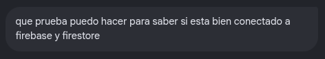

**Respuesta:**

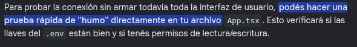
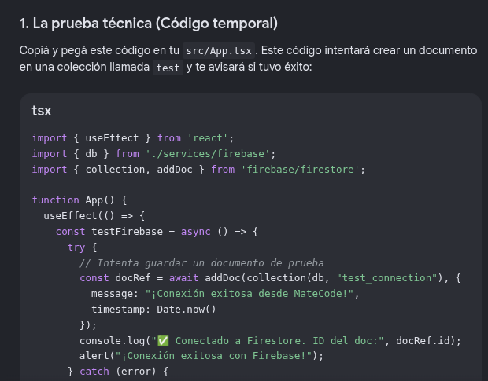
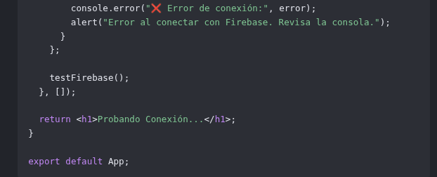

### Mock para servicio de AWS SES

**Prompt:**

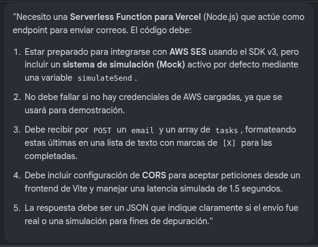

**Respuesta:**

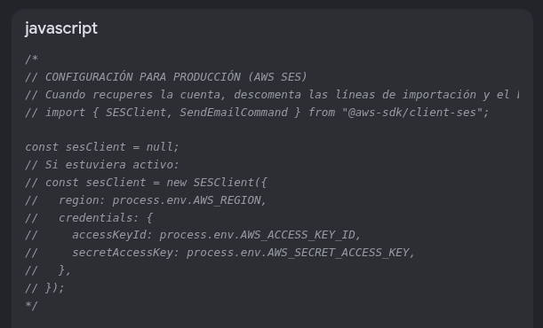
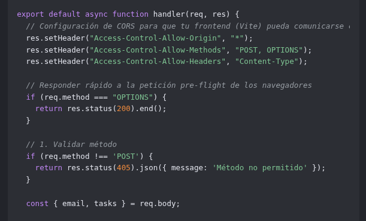
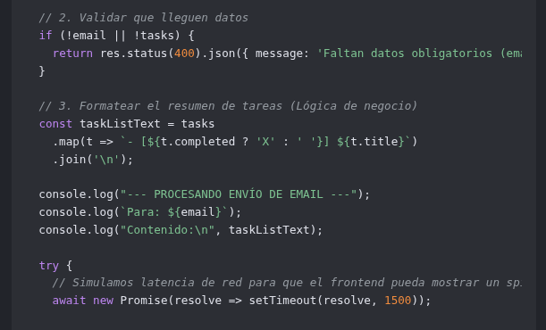
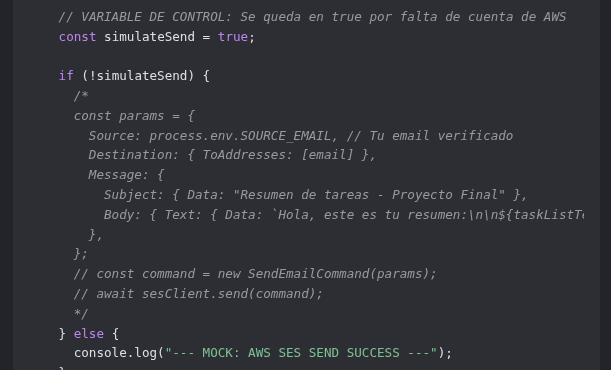
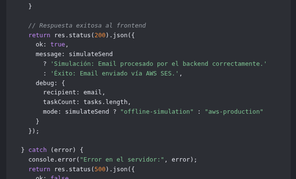
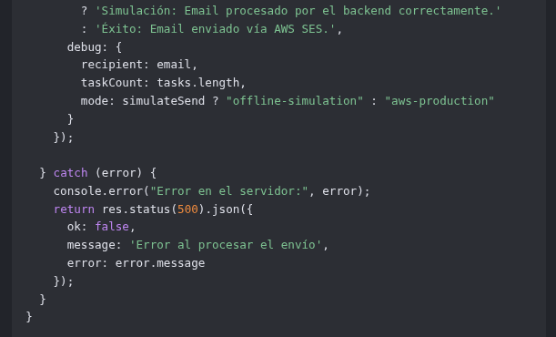

### Ordenamiento manual de lista de tareas

**Prompt:**

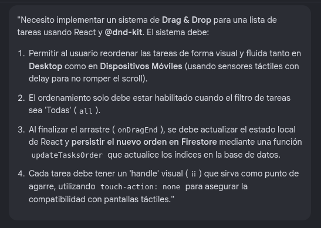

**Respuesta:**

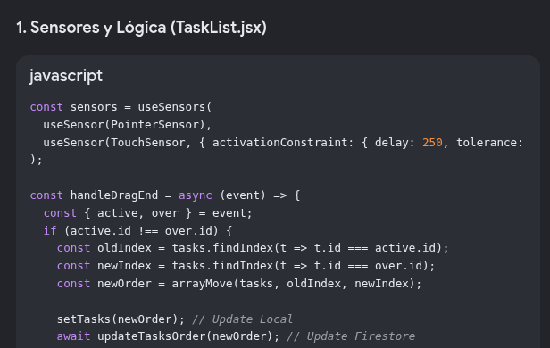
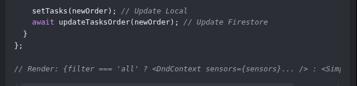
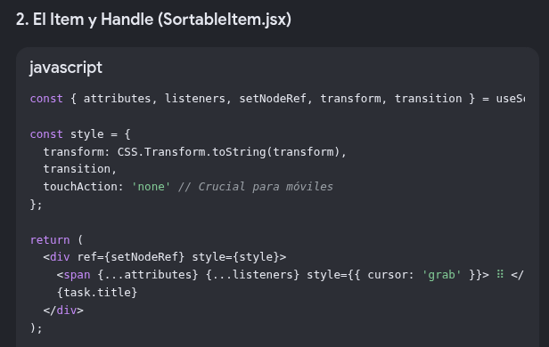
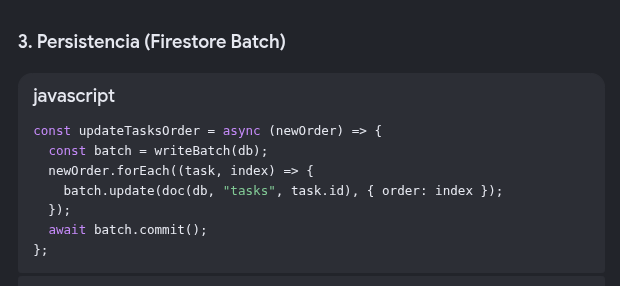


